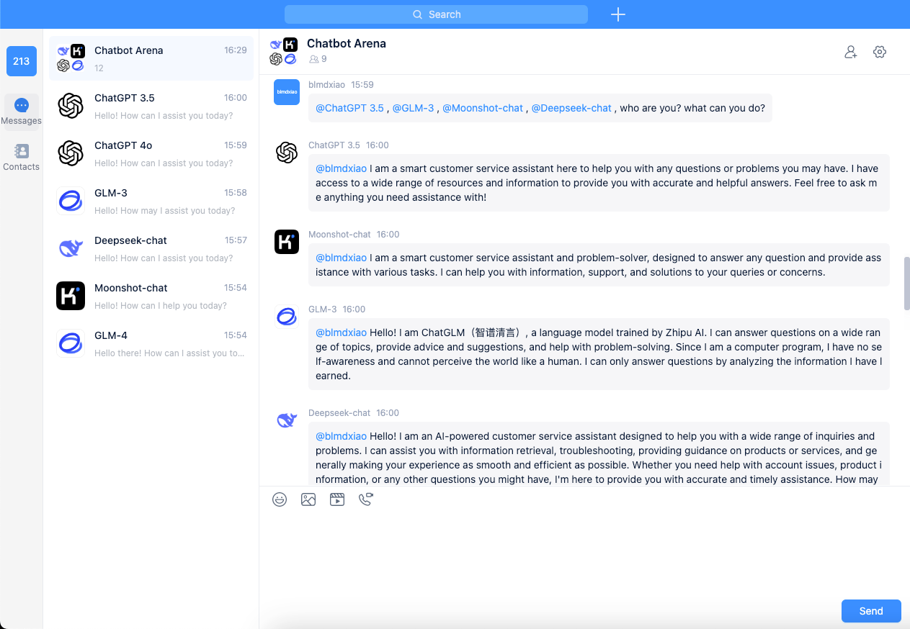
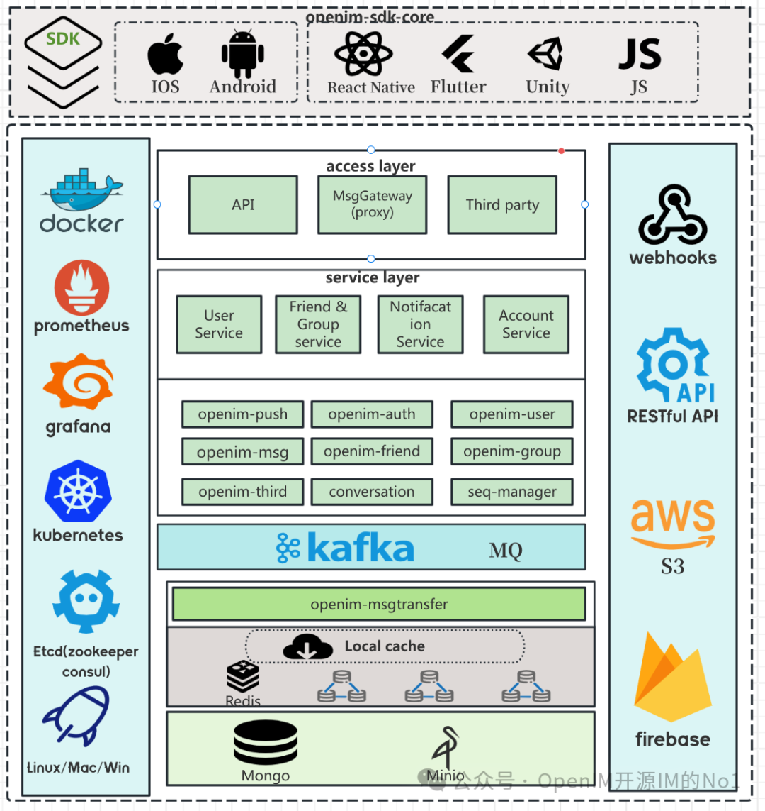
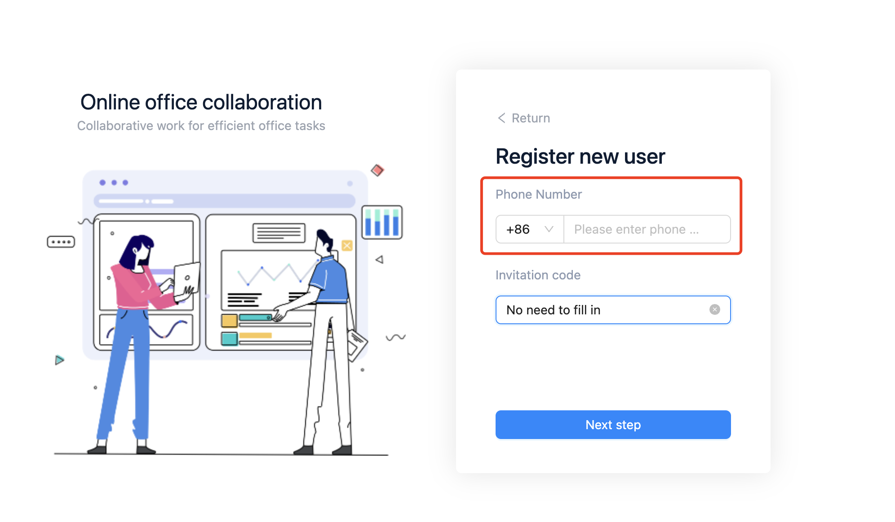
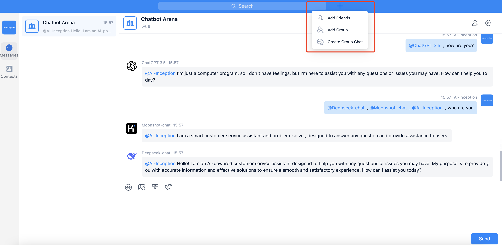

<div align="center">
<h1 align="center">Chatbot-GPT</h1>
Chatbot-GPT leverages OpenIM’s webhooks for seamless integration across messaging platforms, enhancing communication with intelligent, automated responses.
<br/>
<a href="https://chatbot.open-sora.ai/" target="_blank"> Live Demo </a>
<br/>

</div>


# Contents

- [Features](#features)
- [Online Retrieval Architecture](#online-retrieval-architecture)
- [Deploy the Chatbot-GPT Service](#deploy-the-chatbot-gpt-service)
  - [Step 1: Download repository code](#step-1-download-repository-code)
  - [Step 2: Configure variables of .env](#step-2-configure-variables-of-env)
  - [Step 3: Deploy Chatbot-GPT](#step-3-deploy-chatbot-gpt)
    - [Deploy Chatbot-GPT using Docker](#deploy-chatbot-gpt-using-docker)
    - [Deploy Chatbot-GPT from source code](#deploy-chatbot-gpt-from-source-code)
      - [Set up the Python running environment](#set-up-the-python-running-environment)
        - [Create and activate a virtual environment](#create-and-activate-a-virtual-environment)
        - [Install dependencies with pip](#install-dependencies-with-pip)
      - [Upload Bot configuration](#upload-bot-configuratio)
      - [Start the service](#start-the-service)
- [Register Chatbot-GPT](#Register-chatbot-gpt)
  - [Register an account](#register-an-account)
  - [Login and find the Bot](#login-and-find-the-bot)


## Features
- **Integrated LLM Support**: Incorporates both UnionLLM and LiteLLM, enabling simultaneous access to multiple large language models.
- **Quick Setup**: Deploys production-level conversational service robots in just five minutes.
- **Real-World Application**: Optimally designed for real-time customer service systems to tackle genuine business challenges.
- **Attractive UI**: Offers a customizable and visually compelling user interface.


## Online Retrieval Architecture

<div align="center">

</div>


## Deploy the Chatbot-GPT Service

### Step 1: Download repository code

Clone the repository:

```shell
git clone https://github.com/gpt-open/chatbot-gpt.git && cd chatbot-gpt
```

### Step 2: Configure variables of .env

Before starting the Chatbot-GPT service, you need to modify the related configurations for the program to initialize correctly. 


```shell
cp env_example .env
```

The variables in .env

```shell
GET_TOKEN_URL="http://127.0.0.1:10009/account/login"
ADD_BOT_URL="http://127.0.0.1:10009/user/import/json"
UPDATE_BOT_URL="http://127.0.0.1:10008/user/update"
SEND_MSG_URL="http://127.0.0.1:10002/msg/send_msg"
TOKEN_EXPIRE_DAYS=30
MAX_HISTORY_SESSION_LENGTH=3
```

> [!NOTE]
> Please modify the `GET_TOKEN_URL`, `ADD_BOT_URL`, `UPDATE_BOT_URL`, `SEND_MSG_URL`, and `TOKEN_EXPIRE_DAYS` in conjunction with the **OpenIM Server** configuration.
> 


### Step 3: Deploy Chatbot-GPT

#### Deploy Chatbot-GPT using Docker


```shell
docker-compose up --build
```

#### Deploy Chatbot-GPT from source code

> [!NOTE]
> Please use Python version 3.10.x or above.
> 

##### Set up the Python running environment

It is recommended to install Python-related dependencies in a Python virtual environment to avoid affecting dependencies of other projects.

###### Create and activate a virtual environment

If you have not yet created a virtual environment, you can create one with the following command:

```shell
python3 -m venv myenv
```

After creation, activate the virtual environment:

```shell
source myenv/bin/activate
```

###### Install dependencies with pip

Once the virtual environment is activated, you can use `pip` to install the required dependencies. 

```shell
pip install -r requirements.txt
```

##### Upload Bot configuration

> [!NOTE]
> Chatbot-GPT can integrate any number of LLM Bots. 
> 
> Please refer to `bot_config.yaml` and modify this configuration file according to your actual needs.
> 
> **`userID`** in `bot_config.yaml` must be unique.
> 

```yml
robots:
  OpenAI:
    - apiKey: "xxxx"
      model: "gpt-3.5-turbo"
      userID: "openai_robot1"
      nickname: "ChatGPT 3.5"
      faceURL: "https://openai.xiniushu.com/img/logo.png"
    - apiKey: "xxxx"
      model: "gpt-4o"
      userID: "openai_robot2"
      nickname: "ChatGPT 4o"
      faceURL: "https://openai.xiniushu.com/img/logo.png"

  ZhipuAI:
    - apiKey: "xxxx"
      model: "glm-3-turbo"
      userID: "zhipuai_robot1"
      nickname: "GLM-3"
      faceURL: "https://pp.myapp.com/ma_icon/0/icon_54321899_1717467379/256"
    - apiKey: "xxxx"
      model: "glm-4"
      userID: "zhipuai_robot2"
      nickname: "GLM-4"
      faceURL: "https://pp.myapp.com/ma_icon/0/icon_54321899_1717467379/256"

  Moonshot:
    - apiKey: "xxxx"
      model: "moonshot-v1-32k"
      userID: "moonshot_robot1"
      nickname: "Moonshot-chat"
      faceURL: "https://encrypted-tbn0.gstatic.com/images?q=tbn:ANd9GcSnsfyv3cjhrqvNb-Mos6InwLI4Pnjdxiw8CVtxA-tRSlRWwl-nba84&usqp=CAE&s"

  Deepseek:
    - apiKey: "xxxx"
      model: "deepseek/deepseek-chat"
      userID: "deepseek_robot1"
      nickname: "Deepseek-chat"
      faceURL: "https://avatars.githubusercontent.com/u/148330874?s=200&v=4"
```


```shell
python3 upload_bot_config.py
```

##### Start the service

If you have completed the steps above, you can try to start the Chatbot-GPT service by executing the following command.

- **Start single process:**

```shell
python3 chatbot_app.py
```

- **Start multiple processes:**

```shell
sh start.sh
```

> [!NOTE]
> - The service port for Chatbot-GPT is **`9000`**. During the first test, please try not to change the port so that you can quickly experience the entire product process.
> - We recommend starting the Chatbot-GPT service using **`start.sh`** in multi-process mode for a smoother user experience.


## Register Chatbot-GPT

### Register an account

Please visit the link `http://127.0.0.1:9000/#/login` and register using your mobile number. The demo here does not require SMS verification code validation.

<div align="center">

</div>

### Login and find the Bot

Log in to Chatbot-GPT using your username and password, then you can add friends or join groups.

<div align="center">

</div>


